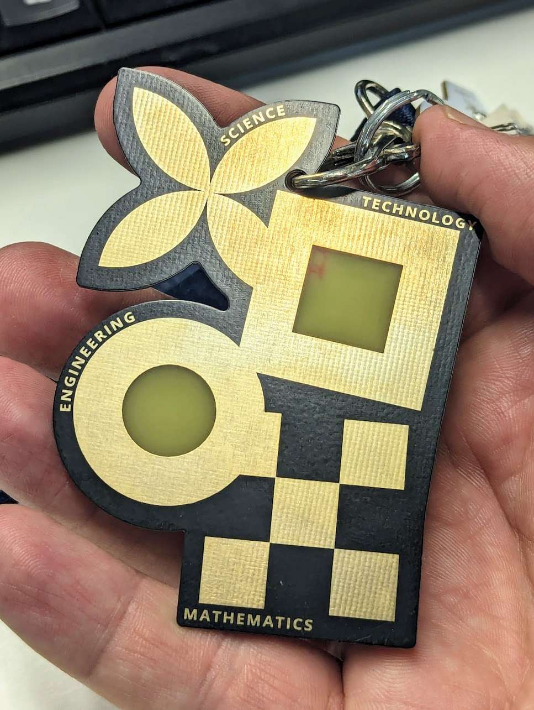
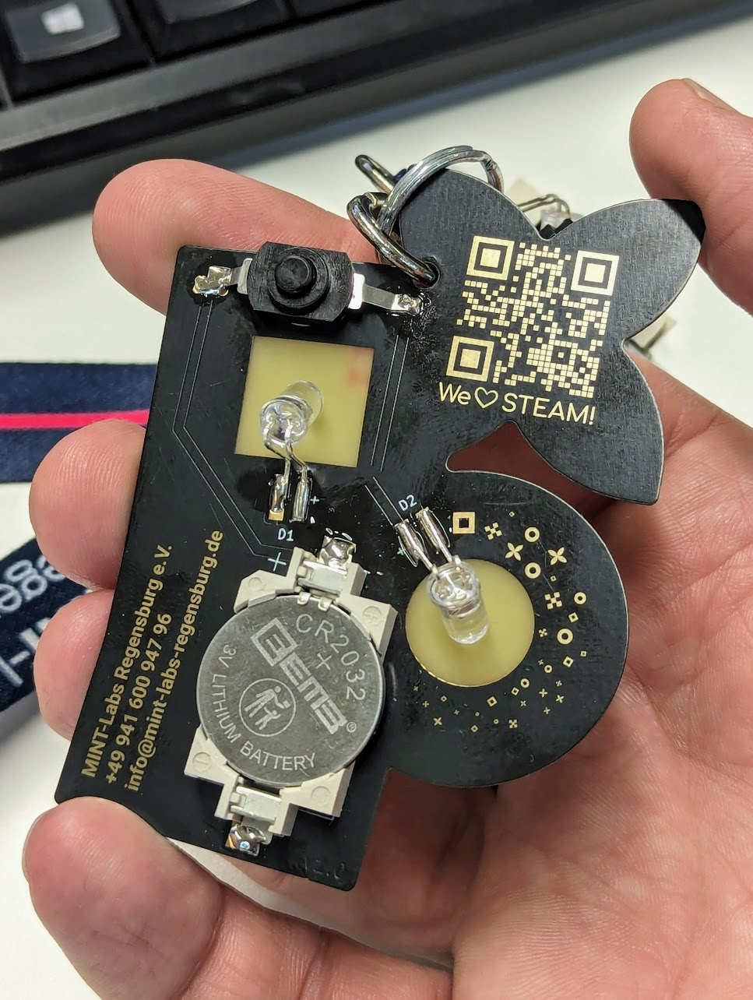

# MINT-Labs Regensburg e.V. PCB Biznizz-Card

A very simple pcb and soldering kit or buisness card or both.

 
g
- Status: **Complete**
- Difficulty: **1/5**

### Parts List

| Description                   | Quantity |
|-------------------------------|----------|
| RGB LEDs 5mm                  |     2    |
| Button (SMD)                  |     1    |
| CR2032 Battery Holder (SMD)   |     1    |
| CR2032 Battery (not included) |     1    |

### Manual
There is no manual yet.

### Copyright and Authorship

- Board [CC-BY-SA 4.0](https://creativecommons.org/licenses/by-sa/4.0/) - [MINT-Labs Regensburg e.V.](https://www.mint-labs-regensburg.de)
- Design & Logo - Copyright - [MINT-Labs Regensburg e.V.](https://www.mint-labs-regensburg.de)
